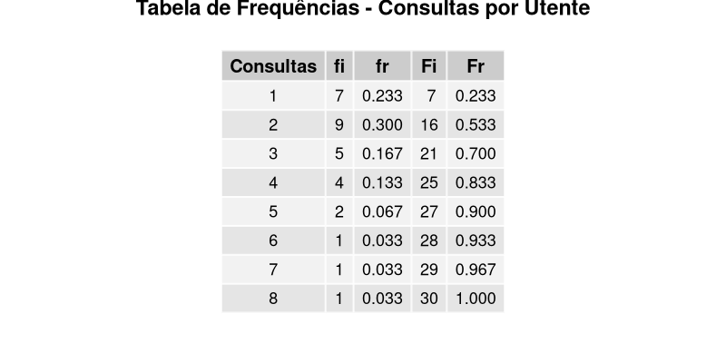

[Numa Unidade de Saúde Familiar (USF), foram registados o número de consultas realizadas por 30 utentes durante o último ano.](../num_consultas_anuais_por_utentes.csv)
> a) Identifica a variável em estudo e classifica-a (discreta ou contínua). Justifica.

A variável é número de consultas por utente no último ano. O tipo de variável é discreta porque são números inteiros e resultam de uma contagem. Não existe 2.5 consultas.

> b) Constrói uma tabela de frequências completa (Frequência Absoluta, Relativa, Absoluta Acumulada, Relativa Acumulada).

> c) Interpreta o significado da 3ª linha da tabela (a linha correspondente a 3 consultas).

5 pessoas tiveram 3 consultas no ultimo ano. 17% de 30 utentes tiveram 3 consultas. 21 pessoas tiveram 3 ou menos consultas no ultimo ano. 70% de 30 utentes tiveram ate 3 consultas

> d) Quantos utentes tiveram 4 ou mais consultas? Qual a percentagem?

4+2+1+1+1=9 utentes
9/30 = 0.3 = 30%

> e) Qual a percentagem de utentes que tiveram menos de 3 consultas?

7+9=16 utentes
16/30 = 0.53333 = 53,3%