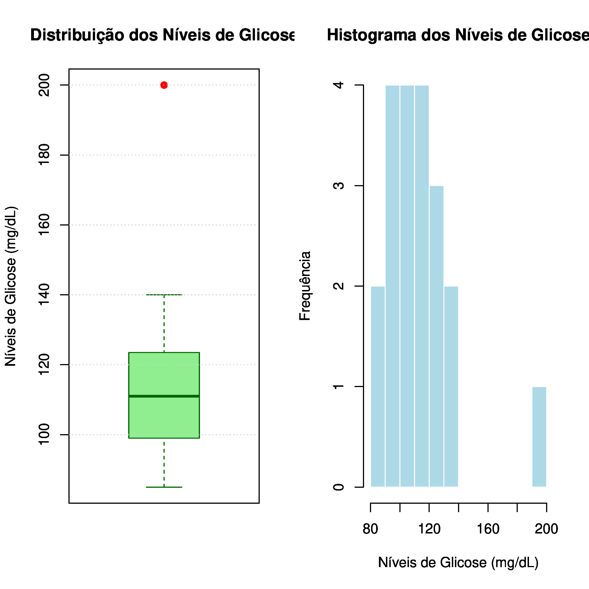
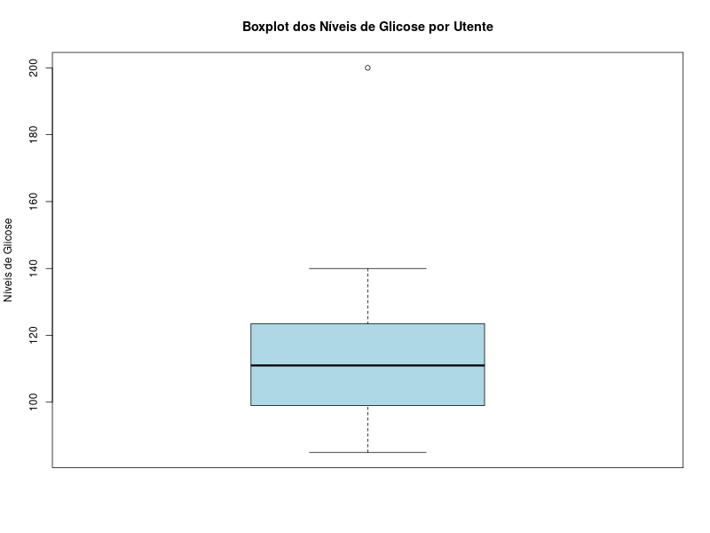

## Como executar
Instalar R
```
sudo apt install r-base r-base-dev
```

Rodar o programa
```
Rscript <nome-do-ficheiro>.r
```

## Níveis de glicose por utente
[Níveis de glicose em jejum de 20 pacientes](niveis_glicose_por_utente.md)



### $Q2$
$\tilde{x}$ = (110+112)/2   
$\tilde{x}$ = 111  
$Q2$=111 mg/dL

### $Q1$
(20+1) · 0.25 = 5,25  
Entre 5º e 6º valor  
5º = 98, 6º = 100  
100-98 = 2  
$Q1$=98+0,25 · 2 = 98,5 mg/dL

### $Q3$
(20+1) · 0.75 = 15,75  
Entre 15º e 16º valor  
15º = 122, 16º = 125  
125-122 = 3  
$Q3$ = 122+0.75 · 3 = 124,25 mg/dL

$AIQ$ = $Q3$ - $Q1$  
$AIQ$=124,25 - 98,5 mg/dL  
$AIQ$=25,75 mg/dL  

LI=98.5-1,5 · 25,75 = 59,875 mg/dL  
LS=124,25+1.5 · 25,75 = 162,875  

Valores a verificar:  
- Mínimo = 85 > 59,875 (ok)
- Máximo = 200 > 162,875 --> 200 é outlier
